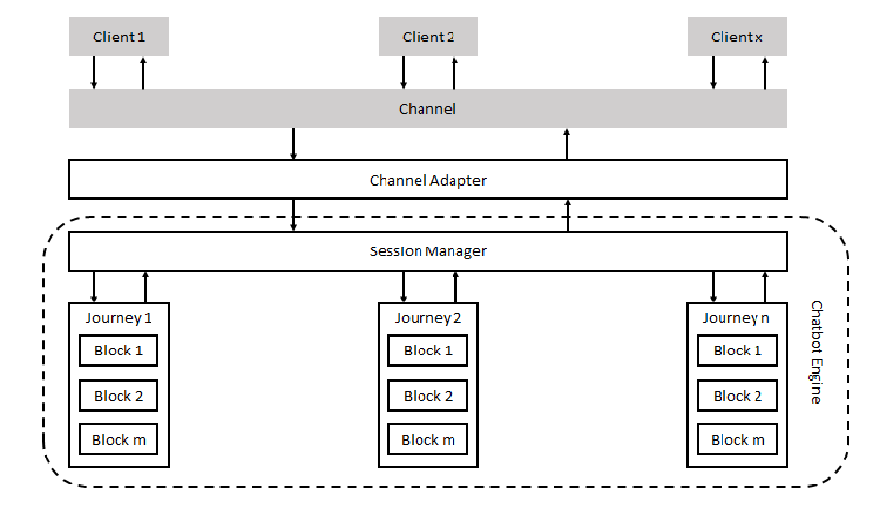

<h1 align="center">BotFramework Architecture</h1>

## Terms
1. Client - User interacting with the chatbot
2. Channel - Medium of communication with the chatbot. Can be a web-based custom UI integrated to your portal, commonly used chat apps like Slack, Skype, Whatsapp etc or even text messages
3. Channel adapters - Programs (RESTful services) to interact with specific channels
4. Journey - A number of tasks performed by the chatbot towards an unique goal
5. Blocks - Unit task within a Journey
6. Session Manager - Session is a stateful interchange of data between client and chatbot persisted temporarily and Session Manager is responsible for managing all sessions
7. Intent Identification - Identify intent from client input e.g.- messages like "Hi", "Hello", "How are you today?" indicate greeting message from user
8. Named Entity Resolution (NER) - Identify entity of interest from a client input e.g. - in a message "Show me options in Kolkata" chatbot may be interested in city name of "Kolkata"

## Concept
Any chatbot can be represented as a combination of:
* collection of Journeys where each Journey involves a bunch of Blocks
* Session Manager managing a session between a client and the chatbot app
* Channel adapters to integrate to specific channels



Combination of the Session Manager and Journeys form the Chatbot Engine. While Channel Adapters enable the engine to communicate with the Channel of choice.

To elaborate the flow, let's consider:
1. Client initiates a dialogue by sending a message through the Channel. 
2. Channel Adapter deals with Channel specific message formats and integration logic and relays a standard format message to Session Manager in following format.

```json
{
    "user": "sidd",
    "message": {
        "messageId": "msg1",
        "messageText": "Hi",
        "messageType": "plaintext",
        "attachments":[
            {
                "attachmentId": null,
                "atachmentSeq": null,
                "attachmentDesc": null,
                "attachmentType": null,
                "options": [],
                "optionsSelected":[]

            }
        ]
    }
}
```
3. Session Manager  
   * creates a Session for the user
   * based on the incoming payload maps it to a Journey and Block based on fuzzy logic (Intent Identification model has been used for the logic)

4. Blocks are responsible to perform a number of tasks:  
   * Map input payload to desired format (as a straight-forward action button input or use NER to extract entity of interest)
   * Get session variables
   * Check for conditional logic
   * Invoke external API's
   * Set session variables
   * Set pointer to next Block (within or outside the scope of the Journey)
   * Generate responses to be sent to Client

5. Channel adapters translate Chatbot Engine response to Channel specific format and sends it to Channel
6. At this point, Client may provide specific inputs requested by the Chatbot relevant to the Journey initiated
7. Like #2, Channel Adapters sends it to Session Manager
8. Session Manager identifies the input is relevant to a specific Session for which Journey has already been initiated and executes the Block of the Journey relevant to that Session

And the process continues...

We find Chatbots can follow the above flow irrespective of use case/requirements. Requirements are saved as configrations. As an example, refer to the JSON configuration of AdminBot [here](../bots/AdminBot/config/AdminBot.json)

Hopefully it explains the buildings blocks for BotFramework.